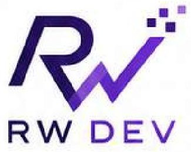
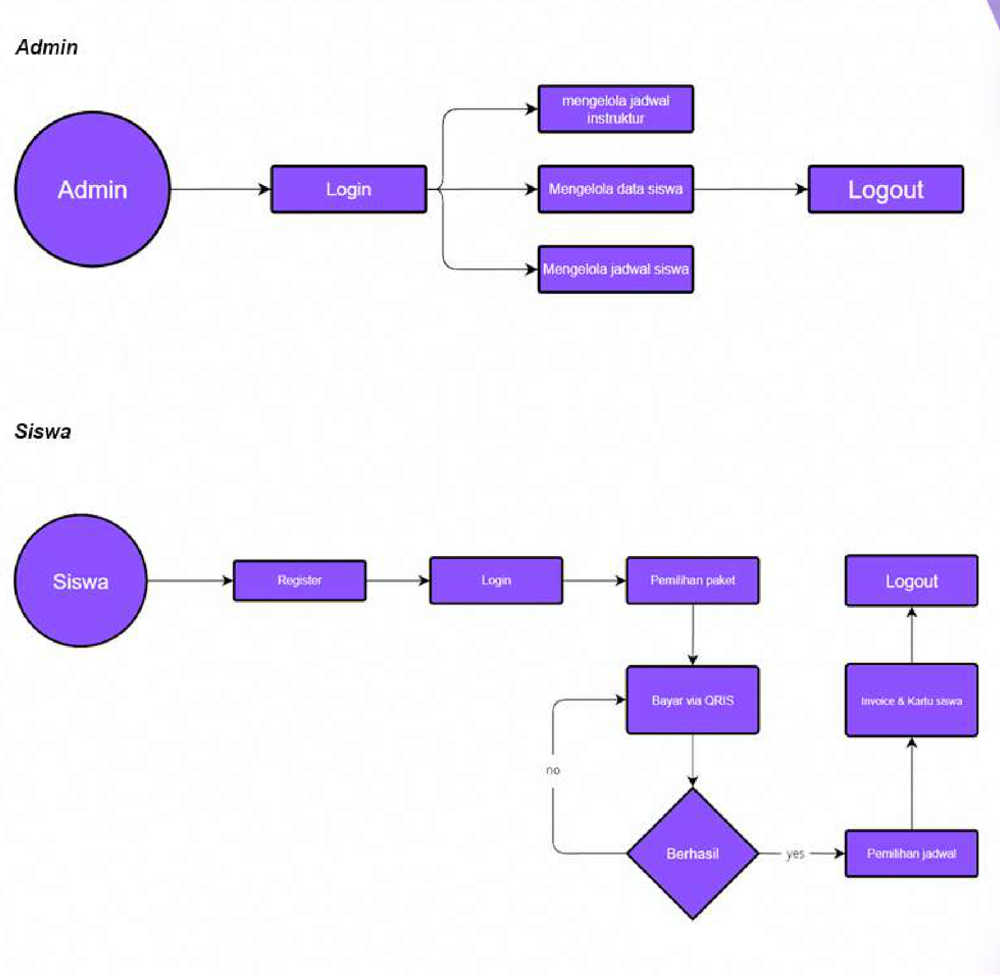
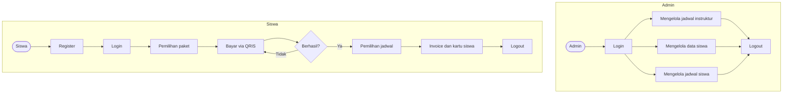

# Proposal Project: Kursus Mengemudi Pulung

**Pengelolaan data dan invoice siswa**

- **Penyusun:** Muhammad Rosyad Nahji
- **Penyedia:** RW Dev
- **Alamat:** RW Warehouse, Jl. Medokan Asri Barat VIII M-20

## Project Brief

### Overview

Sistem ini dirancang untuk membantu merekap data siswa, mengatur jadwal kursus, dan melakukan pembayaran online.

Tujuan pembuatan sistem adalah meningkatkan efisiensi pekerjaan admin melalui transisi dari input data manual menjadi otomatis.

### Manfaat Sistem

- Mempermudah calon pelanggan memperoleh informasi produk melalui landing page.
- Mempermudah admin merekap data siswa dan membagi jadwal instruktur.
- Mempermudah proses pendaftaran dan pemilihan jadwal kursus bagi siswa.

## Anggaran Biaya

Berikut rincian hasil yang telah dibahas beserta biayanya.

| Komponen | Biaya |
|---|---:|
| Domain & hosting (1 tahun) | Rp3.600.000 |
| Jasa maintenance (1 tahun) | Rp1.200.000 |
| Full-stack development | Rp6.000.000 |
| Pembuatan landing page | **Gratis** — nilai normal Rp1.000.000 |
| Rebranding desain | **Gratis** — nilai normal Rp1.000.000 |
| **Total biaya tahun pertama** | **Rp10.800.000** |
| **Tahun kedua dan seterusnya** | **Rp400.000/bulan** |

Biaya tahun kedua dan seterusnya mencakup domain, hosting, dan maintenance.

## Fitur Aplikasi

Aplikasi berbasis web ini akan memiliki fitur-fitur berikut:

| Fitur | Deskripsi |
|---|---|
| Katalog pilihan kelas | Menampilkan jenis-jenis kelas yang tersedia. |
| Pendaftaran siswa | Pendataan siswa baru dengan integrasi spreadsheet Excel. |
| Jadwal tersedia | Pengaturan, pemilihan, pemindahan, dan penutupan jadwal dengan integrasi spreadsheet Excel. |
| Pembayaran online | Pembayaran siswa melalui QRIS dengan konfirmasi manual oleh admin. |
| Notifikasi pembayaran | Admin menerima notifikasi setelah siswa melakukan pembayaran. |
| Invoice | Nota pembayaran dibuat otomatis setelah siswa melakukan pembayaran. |
| Kartu siswa | Kartu siswa digital dalam format PDF yang berisi jadwal pilihan siswa. |

## Alur Aplikasi

### Diagram Asli

### Diagram Mermaid

## Syarat dan Ketentuan

### 1. Ketepatan Fungsionalitas yang Disepakati

- Klien harus mematuhi fungsionalitas yang telah disepakati dalam dokumen ini.
- Perubahan terhadap fungsionalitas utama tidak diizinkan tanpa persetujuan kedua belah pihak.

### 2. Perubahan atau Penambahan Fungsionalitas

- Permintaan fungsionalitas tambahan di luar kesepakatan harus diajukan terlebih dahulu.
- Penyedia layanan akan mengevaluasi permintaan tersebut dan memberikan penawaran biaya tambahan yang sesuai.

### 3. Biaya Tambahan untuk Perubahan

- Setiap perubahan atau penambahan fungsionalitas di luar dokumen fungsionalitas awal akan dikenakan biaya tambahan.
- Besarnya biaya ditentukan berdasarkan kompleksitas dan dampak perubahan terhadap proyek.

### 4. Jadwal dan Dampak Waktu

- Perubahan atau penambahan fungsionalitas dapat memengaruhi jadwal proyek yang telah disepakati.

### 5. Pembayaran Biaya Tambahan

- Biaya yang timbul akibat perubahan atau penambahan fungsionalitas harus dibayarkan oleh klien sesuai persetujuan.
- Pembayaran harus dilakukan sesuai kesepakatan pembayaran yang telah ditetapkan.

### 6. Ketidakpatuhan terhadap Kesepakatan

- Jika klien melakukan perubahan tanpa persetujuan, penyedia layanan berhak menangguhkan pekerjaan sampai masalah diselesaikan dan biaya tambahan dibayarkan.

### 7. Revisi Dokumen Fungsionalitas

- Jika perubahan fungsionalitas disetujui, dokumentasi akan diperbarui untuk mencerminkan perubahan tersebut.

### 8. Kemungkinan Perubahan Harga

- Perubahan atau penambahan fungsionalitas dapat berdampak pada total biaya proyek.
- Penyedia layanan berhak meninjau dan menyesuaikan harga proyek sesuai perubahan yang disepakati.

## Kontak RW Dev

Terima kasih atas kepercayaan Anda kepada RW Dev. Kami siap membantu mewujudkan sistem yang efisien, modern, dan sesuai kebutuhan bisnis Anda.

| | Kontak |
|:---:|---|
|  | **RW Warehouse** Jl. Medokan Asri Barat VIII M-20 |
|  | **WhatsApp** [0811-0000-0003](https://wa.me/6281100000003) |

